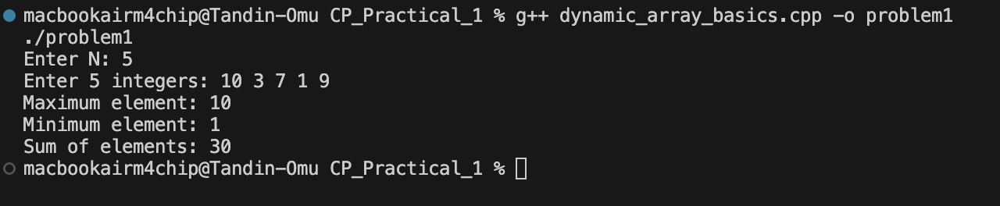
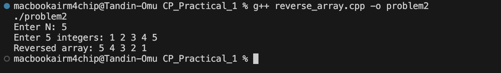
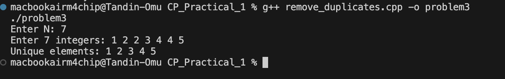
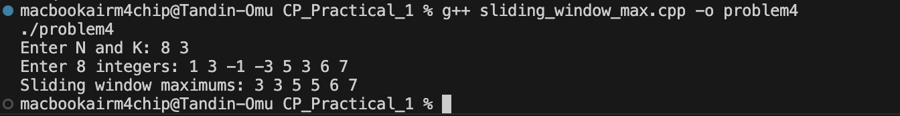
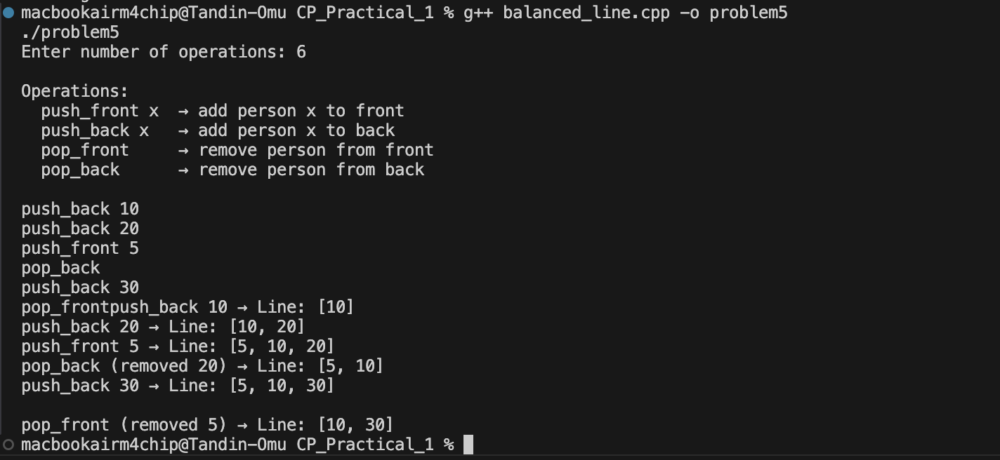
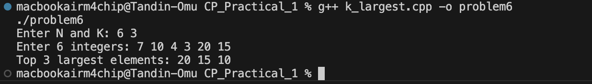
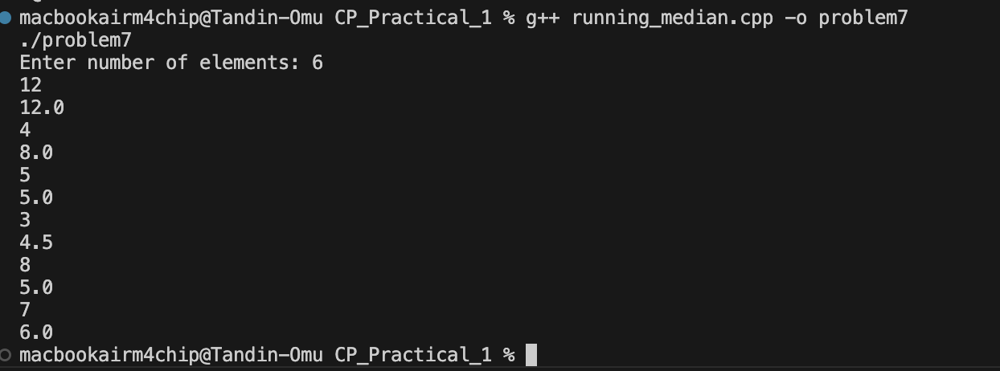
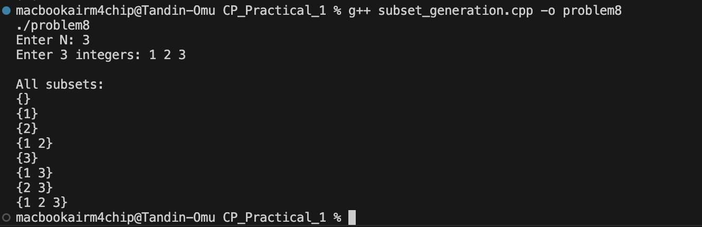
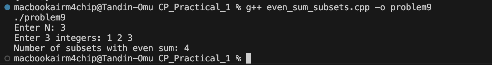
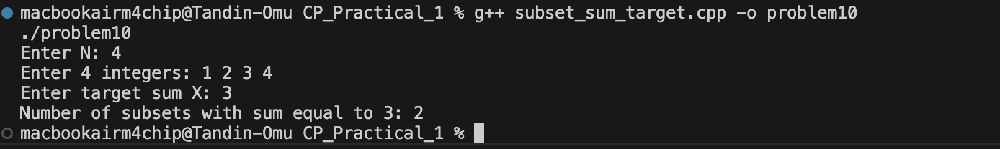

# CP_Practicals_1 — Analysis

---

## Problem 1 — Dynamic Array Basics

### Problem Summary
Read N integers from the user, store them in a vector, and print the maximum element, minimum element, and sum of all elements.

### Algorithm Explanation
1. Read N from the user.
2. Use a `vector<int>` to store N integers dynamically using `push_back()`.
3. Loop through the vector once, comparing each element to track max, min, and accumulate the sum.

### Time Complexity
- **O(n)** — Single loop through all elements.

### Space Complexity
- **O(n)** — All N integers stored in the vector.

### Reflection
This problem introduced me to `vector`, which is like an array but can grow in size automatically. I learned how to use `push_back()` to add elements one by one. Finding max and min manually helped me understand how loops and conditionals work together in C++.

### Screenshot

---

## Problem 2 — Reverse the Array

### Problem Summary
Given N integers, print them in reverse order — last element first, first element last.

### Algorithm Explanation
1. Read N integers into a vector.
2. Use a loop starting from index `n-1` and decrement down to `0`, printing each element.

### Time Complexity
- **O(n)** — Single reverse loop through the array.

### Space Complexity
- **O(n)** — All elements stored in the vector.

### Reflection
This problem taught me how index-based access works in a vector. By starting the loop at `n-1` (the last index) and going down to `0`, I can print elements in reverse without needing any extra data structure or built-in reverse function.

### Screenshot

---

## Problem 3 — Remove Duplicates

### Problem Summary
Given N integers, remove all duplicate values and print only the unique numbers in sorted order.

### Algorithm Explanation
1. Read N integers into a vector.
2. Sort the vector using `sort()` — this brings all duplicates next to each other.
3. Loop through the sorted vector and skip any element that is equal to the one before it.

### Time Complexity
- **O(n log n)** — Sorting dominates; the loop after is O(n).

### Space Complexity
- **O(n)** — All elements stored in the vector.

### Reflection
Sorting first was a smart trick — it groups duplicates together so I only need to compare each element with the one before it. I also learned about the `sort()` function from the `<algorithm>` library which made sorting a vector very easy.

### Screenshot

---

## Problem 4 — Sliding Window Maximum

### Problem Summary
Given an array of N integers and a window size K, slide the window from left to right and print the maximum value inside each window position.

### Algorithm Explanation
Use a `deque` to store **indices** of potentially useful elements:
1. For each new element at index `i`:
   - Remove indices from the **front** that are outside the current window (index < i - k + 1).
   - Remove indices from the **back** whose values are smaller than the current element (they can never be the max).
   - Push the current index to the back.
2. Once `i >= k-1`, the front of the deque holds the index of the maximum for the current window.

### Time Complexity
- **O(n)** — Each index is pushed and popped from the deque at most once.

### Space Complexity
- **O(k)** — The deque holds at most K indices at any time.

### Reflection
This problem was challenging at first. A brute force approach would check every window of size K manually, giving O(n×k). Using a deque reduced it to O(n) because we discard elements that can never be the maximum for future windows. The key insight is: if a new element is larger than elements already in the deque, those old elements are useless and can be thrown away.

### Screenshot

---

## Problem 5 — Balanced Line Problem

### Problem Summary
Simulate a line of people where you can add or remove people from both the front and the back. After each operation, print the current state of the line.

### Algorithm Explanation
Use a `deque<int>` which supports O(1) insert and delete from both ends:
- `push_front x` : `dq.push_front(x)`
- `push_back x`  :`dq.push_back(x)`
- `pop_front`    :check not empty, then `dq.pop_front()`
- `pop_back`     :check not empty, then `dq.pop_back()`

After each operation, loop through the deque and print its contents.

### Time Complexity
- **O(1) per operation** — All deque front/back operations are constant time.
- **O(n)** total for n operations.

### Space Complexity
- **O(n)** — At most n elements in the deque at any time.

### Reflection
The `deque` (double-ended queue) is the perfect structure here because a regular queue only supports insertion at one end and deletion at the other. The deque allows both, making it ideal for simulating a flexible line. I also practised checking if the container is empty before popping to avoid crashes.

### Screenshot

---

## Problem 6 — K Largest Elements

### Problem Summary
Given N numbers, find and print the K largest numbers in descending order.

### Algorithm Explanation
1. Push all N elements into a `priority_queue<int>` (max-heap by default in C++).
2. The max-heap always keeps the largest element at the top.
3. Call `.top()` to read and `.pop()` to remove, exactly K times, to extract the K largest elements in order.

### Time Complexity
- **O(n log n)** — Each push into the heap costs O(log n), done n times.
- Popping K times costs O(k log n).

### Space Complexity
- **O(n)** — All elements stored in the heap.

### Reflection
The `priority_queue` in C++ is a max-heap by default, meaning the largest element is always at the top. This made extracting the K largest very easy — just pop K times. I learned that a heap is more efficient than fully sorting the array when we only need the top K elements.

### Screenshot

---

## Problem 7 — Running Median

### Problem Summary
After reading each new number from a stream of integers, print the current median of all numbers read so far.

### Algorithm Explanation
Maintain two heaps:
- A **max-heap** (`maxHeap`) storing the smaller half of numbers seen so far.
- A **min-heap** (`minHeap`) storing the larger half.

Keep both heaps balanced so `maxHeap` has equal size or one more element than `minHeap`.

For each new number:
1. If it is ≤ top of `maxHeap`, push to `maxHeap`; otherwise push to `minHeap`.
2. Rebalance: if sizes differ by more than 1, move the top of the larger heap to the smaller.
3. Print the median:
   - **Odd count** : median = top of `maxHeap`
   - **Even count** : median = average of both tops

### Time Complexity
- **O(n log n)** — Each insertion and rebalance is O(log n), done n times.

### Space Complexity
- **O(n)** — All elements stored across the two heaps.

### Reflection
This was the most complex problem. The two-heap approach was a revelation — keeping a max-heap for the lower half and a min-heap for the upper half means the median is always at the tops. The challenge was keeping the heaps balanced in size after every insertion.

### Screenshot

---

## Problem 8 - Subset Generation

### Problem Summary
Given a set of N numbers, generate and print all possible subsets (including the empty set). For N=3, there are 2³ = 8 subsets.

### Algorithm Explanation
Use the **bitmask technique**:
- There are `2^N` possible subsets, numbered `0` to `2^N - 1`.
- The binary representation of each number acts as a selector:
  - If bit `i` is `1` : include `arr[i]` in the subset.
  - If bit `i` is `0` : exclude `arr[i]`.

Example for N=3, mask = 5 (binary `101`):
- Bit 0 is 1 : include arr[0]
- Bit 1 is 0 : skip arr[1]
- Bit 2 is 1 : include arr[2]

### Time Complexity
- **O(2^n × n)** - For each of the 2^n masks, we scan n bits.

### Space Complexity
- **O(n)** - Only the input array; subsets are printed directly.

### Reflection
Bitmasking was a completely new concept for me. The idea that a binary number can represent a "yes/no" choice for each element is very elegant. The bit shift operator `>>` and bitwise AND `&` are tools I hadn't used before, but now I understand how they let us check individual bits efficiently.

### Screenshot

---

## Problem 9 - Count Subsets with Even Sum

### Problem Summary
Given N numbers, count how many of the 2^N possible subsets have a sum that is even (divisible by 2). The empty set has sum 0, which counts as even.

### Algorithm Explanation
1. Use the bitmask technique from Problem 8 to enumerate all subsets.
2. For each subset (mask), compute the sum of selected elements.
3. If `sum % 2 == 0`, increment the counter.

Example for {1, 2, 3}:
- `{}` = 0 | `{1}` = 1 | `{2}` = 2 | `{1,2}` = 3 
- `{3}` = 3 | `{1,3}` = 4 | `{2,3}` = 5  | `{1,2,3}` = 6 

Total: **4 subsets** with even sum.

### Time Complexity
- **O(2^n × n)** - Same as subset generation with an added O(1) check per mask.

### Space Complexity
- **O(n)** — Only the input array.

### Reflection
Building on Problem 8, this problem added a simple filter — checking if the subset sum is even using `% 2 == 0`. It reinforced how bitmask enumeration is a powerful general technique that can be extended with any condition.

### Screenshot

---

## Problem 10 — Count Subsets with Sum Equal to Target

### Problem Summary
Given N numbers and a target value X, count how many subsets have a sum exactly equal to X.

### Algorithm Explanation
1. Use the bitmask technique to enumerate all 2^N subsets.
2. For each subset (mask), compute the sum of included elements.
3. If `sum == target`, increment the counter.

Example for {1, 2, 3, 4}, target = 3:
- `{3}` = sum = 3 
- `{1, 2}` = sum = 3 
- All other subsets have a different sum.

Total: **2 subsets** with sum equal to 3.

### Time Complexity
- **O(2^n × n)** - All 2^n masks checked, each requiring n bit inspections.

### Space Complexity
- **O(n)** - Only the input array is stored.

### Reflection
This problem brought together everything learned in Problems 8 and 9 - using bitmasks to generate subsets and filtering based on a condition. I noticed that Problems 8, 9, and 10 all share the same core loop; only the filter condition changes. This shows how bitmask enumeration is a flexible and reusable pattern in competitive programming.

### Screenshot

