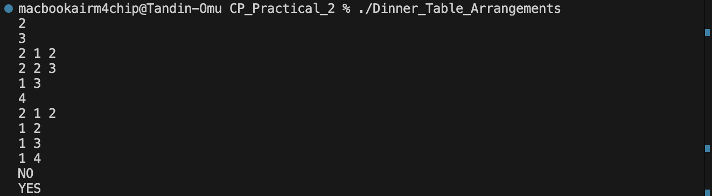
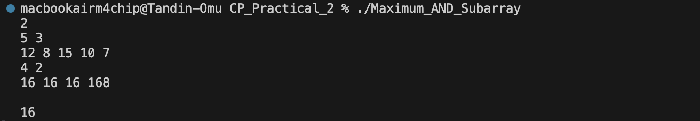
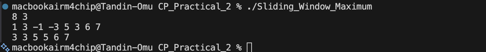
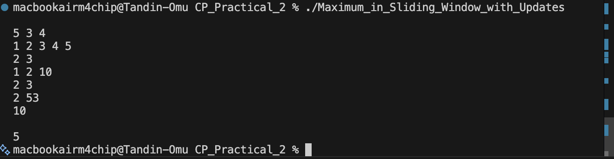
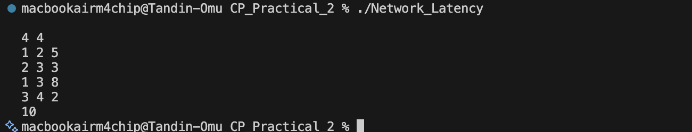
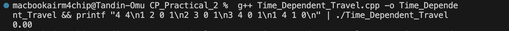
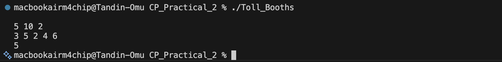

# CP_Practical_2 — Analysis

## Problem 1 — Dinner Table Arrangements

### Problem Summary
Given N friends, each with allergies represented as a bitmask, arrange them around a circular table so that no two adjacent persons share any common allergy. Determine if such an arrangement exists.

### Algorithm Explanation
1. Represent each person's allergies as a bitmask (bits 0-29 for allergy IDs 1-30).
2. Fix person 0 at the first position to handle circular arrangement.
3. Use DFS with memoization: `dp[last][visited]` = whether we can complete the arrangement starting with `last` as the last placed person and `visited` as the set of placed people.
4. At each step, try all unvisited persons who don't share allergies with the last placed person.
5. When all persons are placed, check if the last person is compatible with the first person.

### Time Complexity
- **O(N² × 2^N)** - Each state has O(N) transitions, with N×2^N possible states.

### Space Complexity
- **O(N × 2^N)** - For the memoization table.

### Reflection
This problem taught me how to use bitmasking for subset representation and how to apply DFS with memoization for permutation problems with constraints. The circular arrangement added an extra check between the first and last person. The key insight was fixing one person at the start to break the circular symmetry.

## Problem 2 - Maximum AND Subarray

### Problem Summary
Given an array of N integers and a window size K, find the maximum possible AND value of any contiguous subarray of length exactly K.

### Algorithm Explanation
1. Start with `ans = 0`.
2. For each bit from 31 down to 0:
   - Create candidate = ans | (1 << bit)
   - Check if there exists a subarray of length K where every number has all bits in candidate set.
   - If yes, keep this bit by setting `ans = candidate`.
3. The check is done by creating a boolean array `valid[i] = ((A[i] & candidate) == candidate)` and looking for K consecutive true values.

### Time Complexity
- **O(31 × N)** - 31 bits checked, each requiring an O(N) scan.

### Space Complexity
- **O(N)** - For the input array.

### Reflection
This problem introduced me to the greedy bit-checking approach. Instead of trying all subarrays (O(N²)), we build the answer bit by bit from the most significant bit. The key idea is that if a bit can be set in the answer, there must exist a subarray where all numbers have that bit set. This is an elegant way to maximize a bitwise AND result.

## Problem 3 — Sliding Window Maximum

### Problem Summary
Given an array of N integers and a window size K, find the maximum in each sliding window of size K as the window moves from left to right.

### Algorithm Explanation
Use a deque to store indices of elements in decreasing order:
1. For each new element at index i:
   - Remove indices from the front that are outside the current window.
   - Remove indices from the back whose values are less than or equal to the current element.
   - Push the current index to the back.
2. Once i ≥ K-1, the front of the deque holds the maximum for the current window.

### Time Complexity
- **O(N)** — Each element is pushed and popped from the deque at most once.

### Space Complexity
- **O(K)** — The deque holds at most K indices.

### Reflection
This classic problem taught me how to optimize sliding window maximum queries. A naive approach would check each window separately (O(N×K)), but using a deque reduces it to O(N). The key insight is that if a new element is larger than previous elements, those previous elements can never be the maximum in any future window that includes the new element.

## Problem 4 — Maximum in Sliding Window with Updates

### Problem Summary
Given an array of N elements, process Q queries of two types:
- Type 1: Update A[pos] = val
- Type 2: Query maximum in sliding window of size K ending at index i

### Algorithm Explanation
1. Maintain a `multiset` to store the current window's elements.
2. Track the current window boundaries [left, right].
3. For updates: if the updated position is in the current window, remove the old value and insert the new one.
4. For queries: slide the window to the new range, removing old elements and adding new ones, then output the maximum from the multiset.

### Time Complexity
- **O((N+Q) log K)** — Each insertion/removal in multiset is O(log K).

### Space Complexity
- **O(K)** — The multiset holds at most K elements.

### Reflection
This problem extended the sliding window maximum concept to handle updates. The `multiset` was useful because it allows storing duplicate values and provides O(log n) access to the maximum via `rbegin()`. The challenge was maintaining the window boundaries correctly across interleaved queries and updates.

## Problem 5 — Network Latency

### Problem Summary
Given a network of N routers connected by M bidirectional cables with given latencies, find the minimum latency to send a packet from router 1 to router N.

### Algorithm Explanation
Use Dijkstra's algorithm:
1. Initialize distances with infinity, dist[1] = 0.
2. Use a priority queue to always process the node with the smallest distance.
3. For each neighbor, if the new distance is smaller, update and push to the queue.
4. If dist[N] remains infinity, no path exists (output -1).

### Time Complexity
- **O((N + M) log N)** - Each edge processed once, each node inserted into priority queue at most once.

### Space Complexity
- **O(N + M)** - For adjacency list and distance array.

### Reflection
This was my first implementation of Dijkstra's algorithm. I learned how to use a priority queue to always expand the node with the smallest distance, which is more efficient than a BFS-like approach for weighted graphs. The `typedef pair<ll, int>` helped store both distance and node in the priority queue.

## Problem 6 — Toll Booths

### Problem Summary
A highway has N toll booths in a line. Start at booth 1 with M coins. At each booth i, you can:
- Pay toll[i] coins and move to next booth (cost: 1 minute)
- Skip the booth (cost: 2 minutes) but can only skip at most K booths in total
Find minimum time to reach booth N.

### Algorithm Explanation
1. Use DP: `dp[i][s]` = minimum coins used to reach booth i with exactly s skips.
2. Initialize dp[1][0] = 0.
3. For each booth i from 1 to N-1:
   - Pay: `dp[i+1][s] = min(dp[i+1][s], dp[i][s] + toll[i])`
   - Skip: `dp[i+1][s+1] = min(dp[i+1][s+1], dp[i][s])`
4. Find minimum skips s such that `dp[N][s] ≤ M`.
5. Time = (N-1 - s) × 1 + s × 2 = N-1 + s

### Time Complexity
- **O(N × K)** — N booths processed, K skip states per booth.

### Space Complexity
- **O(N × K)** — DP table.

### Reflection
This problem taught me how to minimize time by minimizing skips. The key insight was that total time = N-1 + s (skips), so minimizing time is equivalent to minimizing skips. This allowed me to focus DP on coins usage rather than time directly. I learned that sometimes transforming the optimization objective can simplify the problem significantly.

## Summary

| Problem | Algorithm | Time Complexity | Space Complexity |
|---------|-----------|-----------------|------------------|
| Dinner Table Arrangements | DFS + Bitmask Memoization | O(N² × 2^N) | O(N × 2^N) |
| Maximum AND Subarray | Greedy Bit Checking | O(31 × N) | O(N) |
| Sliding Window Maximum | Deque | O(N) | O(K) |
| Maximum in Sliding Window with Updates | Multiset + Window Tracking | O((N+Q) log K) | O(K) |
| Network Latency | Dijkstra's Algorithm | O((N+M) log N) | O(N+M) |
| Toll Booths | Dynamic Programming | O(N × K) | O(N × K) |