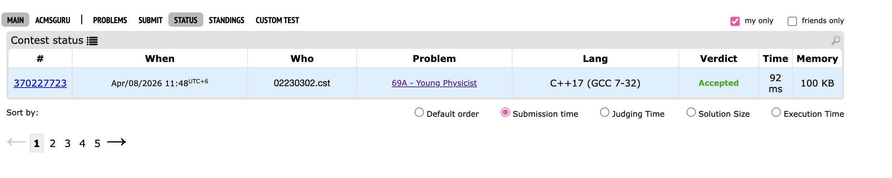
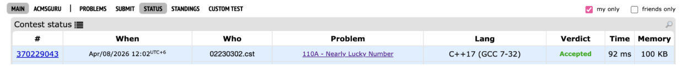
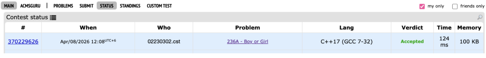
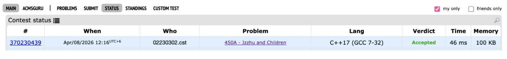
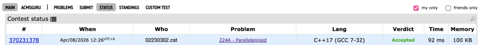

# CP Practical 5 Solutions

## Problem 1: Young Physicist

**Image:**  

### 1. Understanding the Question

**What is given?**  
We are given n force vectors in 3D space. Each force has three components (x, y, z).

**What do these represent?**  
The body starts at position (0, 0, 0). Each force vector pushes the body in some direction.

**What is being asked?**  
We need to check if the body is in equilibrium (not moving).  
A body is in equilibrium when the **sum of all forces** is (0, 0, 0).

**Example from problem:**  
Input:
3
4 1 7
-2 4 -1
1 -5 -3

Sum = (4-2+1, 1+4-5, 7-1-3) = (3, 0, 3) → Not zero → "NO"

### 2. Solution Approach

Let:
\[
S_x = \sum_{i=1}^{n} x_i,\quad S_y = \sum_{i=1}^{n} y_i,\quad S_z = \sum_{i=1}^{n} z_i
\]

**Step 1:** Initialize sums to zero  
\[
S_x = 0,\quad S_y = 0,\quad S_z = 0
\]

**Step 2:** For each force vector (x, y, z):  
\[
S_x = S_x + x,\quad S_y = S_y + y,\quad S_z = S_z + z
\]

**Step 3:** Check equilibrium condition  
If \( S_x = 0 \) and \( S_y = 0 \) and \( S_z = 0 \) → "YES" else "NO"

### 3. Time & Space Complexity

- **Time Complexity:** O(n) — we process each of the n forces once
- **Space Complexity:** O(1) — only three sum variables

---

## Problem 4: Nearly Lucky Number

**Image:**  

### 1. Understanding the Question

**What is given?**  
We are given an integer n (1 ≤ n ≤ 10^18).

**What is a lucky digit?**  
Digits 4 and 7 are called lucky digits.

**What is a lucky number?**  
A number whose digits are all 4 or 7.

**What is a nearly lucky number?**  
A number is nearly lucky if the **count of lucky digits** in it is itself a lucky number.

**Example from problem:**  
Input: `40047`  
Lucky digits: 4, 4, 7 → count = 3 → 3 is not lucky → "NO"

Input: `7747774`  
Lucky digits: all 7 digits are lucky → count = 7 → 7 is lucky → "YES"

### 2. Solution Approach

Let:
- \( n \) = given number as string
- \( c \) = count of digits that are '4' or '7'

**Step 1:** Count lucky digits  
\[
c = \sum_{i=1}^{len(n)} [n[i] == '4' \text{ or } n[i] == '7']
\]

**Step 2:** Check if \( c \) is a lucky number  
Convert \( c \) to string. For each digit \( d \) in \( c \):
- If \( d \neq 4 \) and \( d \neq 7 \) → not lucky

**Step 3:** Output  
If \( c \) is lucky → "YES" else "NO"

### 3. Time & Space Complexity

- **Time Complexity:** O(len(n)) — where len(n) ≤ 19 digits
- **Space Complexity:** O(1) — only a few variables

---

## Problem 7: Boy or Girl

**Image:**  

### 1. Understanding the Question

**What is given?**  
A username string containing only lowercase English letters (length ≤ 100).

**What is the method?**  
Count the number of **distinct characters** in the username:
- If count is **odd** → Male → "IGNORE HIM!"
- If count is **even** → Female → "CHAT WITH HER!"

**Example from problem:**  
Input: `wjmzbmr`  
Distinct characters: w, j, m, z, b, r → count = 6 (even) → "CHAT WITH HER!"

Input: `xiaodao`  
Distinct characters: x, i, a, o, d → count = 5 (odd) → "IGNORE HIM!"

### 2. Solution Approach

Let:
- \( S \) = set of characters in username
- \( d = |S| \) = number of distinct characters

**Step 1:** Extract distinct characters  
\[
S = \{ \text{unique characters in username} \}
\]

**Step 2:** Count distinct characters  
\[
d = \text{size of } S
\]

**Step 3:** Determine gender  
If \( d \% 2 == 0 \) → Female → "CHAT WITH HER!"  
Else → Male → "IGNORE HIM!"

### 3. Time & Space Complexity

- **Time Complexity:** O(n) — where n is length of username (≤ 100)
- **Space Complexity:** O(1) — set stores at most 26 lowercase letters

---

## Problem 10: Jzzhu and Children

**Image:**  

### 1. Understanding the Question

**What is given?**  
- n children in a line, numbered 1 to n  
- Each child i wants at least a[i] candies  
- Jzzhu gives m candies to the first child in line each time

**What is the process?**  
1. Give m candies to first child in line  
2. If child now has enough (≥ a[i]), they leave  
3. If not enough, child goes to back of line  
4. Repeat until line is empty

**What is being asked?**  
Find the **index** (1-based) of the **last child** who leaves.

**Example from problem:**  
Input:
5 2
1 3 1 4 2

Output: `4`

### 2. Solution Approach

Let:
- \( a[i] \) = candies needed by child i
- \( m \) = candies given per turn

**Step 1:** Calculate rounds needed for each child  
Each child receives m candies each time they reach the front.  
Number of rounds needed:
\[
\text{rounds}[i] = \lceil \frac{a[i]}{m} \rceil
\]
Using integer arithmetic:
\[
\text{rounds}[i] = \frac{a[i] + m - 1}{m}
\]

**Step 2:** Find child with maximum rounds  
\[
\text{maxRounds} = \max(\text{rounds}[1], \text{rounds}[2], ..., \text{rounds}[n])
\]

**Step 3:** Handle ties  
If multiple children have the same maxRounds, the **rightmost** one (largest index) leaves last.

**Formula:**
\[
\text{answer} = \max_{i} \{ i \mid \text{rounds}[i] = \text{maxRounds} \}
\]

### 3. Time & Space Complexity

- **Time Complexity:** O(n) — we process each child once
- **Space Complexity:** O(1) — only a few variables

---

## Problem 13: Parallelepiped

**Image:**  

### 1. Understanding the Question

**What is given?**  
We are given the areas of three faces of a rectangular box (parallelepiped) that all meet at one corner.

**What do these areas represent?**  
If the edge lengths of the box are \( x \), \( y \), and \( z \), then:

- Face 1 area = \( x \times y \)
- Face 2 area = \( y \times z \)
- Face 3 area = \( z \times x \)

**What is being asked?**  
We need to find the sum of all 12 edges of the box.

Total sum = \( 4x + 4y + 4z = 4(x + y + z) \)

**Example from problem:**  
Input: `1 1 1` → edges are \( 1 \times 1 \times 1 \) → sum = \( 4(1+1+1) = 12 \)

Input: `4 6 6` → edges are \( 2 \times 2 \times 3 \) → sum = \( 4(2+2+3) = 28 \)

### 2. Solution Approach

We are given:
\[
S1 = x \times y,\quad S2 = y \times z,\quad S3 = z \times x
\]

**Step 1:** Multiply all three equations
\[
(xy) \times (yz) \times (zx) = S1 \times S2 \times S3
\]
\[
x^2 y^2 z^2 = S1 \times S2 \times S3
\]

**Step 2:** Take square root
\[
xyz = \sqrt{S1 \times S2 \times S3}
\]

**Step 3:** Solve for each edge

To find \( x \):
\[
x = \sqrt{\frac{S1 \times S3}{S2}}
\]

To find \( y \):
\[
y = \sqrt{\frac{S1 \times S2}{S3}}
\]

To find \( z \):
\[
z = \sqrt{\frac{S2 \times S3}{S1}}
\]

**Step 4:** Calculate total sum of edges
\[
\text{Answer} = 4 \times (x + y + z)
\]

### 3. Time & Space Complexity

- **Time Complexity:** O(1) — only a fixed number of arithmetic operations
- **Space Complexity:** O(1) — only a few variables