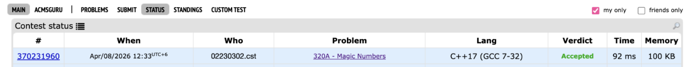
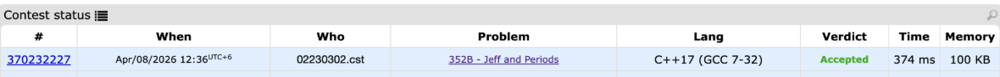

# CP Practical 5 Solutions

## Problem 1: Young Physicist

**Image:**  


**Brief Restatement:**  
We are given n force vectors in 3D space. The body starts at (0,0,0). We need to check if the sum of all vectors is (0,0,0). If yes → "YES", else → "NO".

**Solution Approach:**  
- Read n (number of forces)  
- Initialize three sum variables: sumX = 0, sumY = 0, sumZ = 0  
- For each force, read (x, y, z) and add to respective sums  
- After all forces, check if all three sums are zero  
- Print "YES" if all zero, otherwise "NO"

**Code Snippet:**  
```cpp
int sum_x = 0, sum_y = 0, sum_z = 0;
for (int i = 0; i < n; i++) {
    cin >> x >> y >> z;
    sum_x += x; sum_y += y; sum_z += z;
}
if (sum_x == 0 && sum_y == 0 && sum_z == 0) cout << "YES";
else cout << "NO";
```

---

## Problem 2: (Not Available)

---

## Problem 3: Beautiful Year

**Image:**  


**Brief Restatement:**  
Given a year, find the next year where all 4 digits are different from each other.

**Solution Approach:**  
- Loop from y+1 upward  
- Extract all 4 digits into a set  
- If set.size() == 4 → all digits unique → print year and stop

**Code Snippet:**  
```cpp
for (int year = y+1; ; year++) {
    string s = to_string(year);
    set<char> digits(s.begin(), s.end());
    if (digits.size() == 4) {
        cout << year; break;
    }
}
```

---

## Problem 4: Nearly Lucky Number

**Image:**  


**Brief Restatement:**  
Count digits that are 4 or 7. If that count consists only of digits 4 and 7 → "YES", else "NO".

**Solution Approach:**  
- Read n as string  
- Count digits '4' and '7'  
- Convert count to string  
- Check if all digits of count are '4' or '7'

**Code Snippet:**  
```cpp
int count = 0;
for (char c : n) if (c == '4' || c == '7') count++;
string cntStr = to_string(count);
bool lucky = true;
for (char c : cntStr) if (c != '4' && c != '7') lucky = false;
cout << (lucky ? "YES" : "NO");
```

---

## Problem 5: XOR Strings

**Image:**  


**Brief Restatement:**  
Given two binary strings of equal length, output '1' where digits differ, '0' where same.

**Solution Approach:**  
- XOR works directly on chars  
- Loop and apply XOR

**Code Snippet:**  
```cpp
for (int i = 0; i < a.length(); i++) {
    cout << ((a[i] ^ b[i]) ? '1' : '0');
}
```

---

## Problem 6: Dragons

**Image:**  


**Brief Restatement:**  
Count numbers from 1 to d divisible by at least one of k, l, m, or n.

**Solution Approach:**  
- Use Inclusion-Exclusion Principle with LCM

**Code Snippet:**  
```cpp
int total = d/k + d/l + d/m + d/n;
total -= d/lcm(k,l) + d/lcm(k,m) + d/lcm(k,n) + d/lcm(l,m) + d/lcm(l,n) + d/lcm(m,n);
total += d/lcm(k,l,m) + d/lcm(k,l,n) + d/lcm(k,m,n) + d/lcm(l,m,n);
total -= d/lcm(k,l,m,n);
```

---

## Problem 7: Boy or Girl

**Image:**  


**Brief Restatement:**  
Count distinct characters in username. If count even → "CHAT WITH HER!" (female), odd → "IGNORE HIM!" (male).

**Solution Approach:**  
- Use set to store unique characters  
- Check size % 2

**Code Snippet:**  
```cpp
set<char> distinct(username.begin(), username.end());
if (distinct.size() % 2 == 0) cout << "CHAT WITH HER!";
else cout << "IGNORE HIM!";
```

---

## Problem 8: Effective Approach

**Image:**  


**Brief Restatement:**  
Given array (permutation 1..n) and queries. Count total comparisons for Vasya (search from start) and Petya (search from end). Determine who wins.

**Solution Approach:**  
- Map each value to its position (1-based)  
- For each query b: Vasya = pos[b], Petya = n - pos[b] + 1  
- Sum and compare

**Code Snippet:**  
```cpp
int pos[100005];
for (int i = 1; i <= n; i++) { cin >> x; pos[x] = i; }
long long vasya = 0, petya = 0;
while (m--) { cin >> b; vasya += pos[b]; petya += n - pos[b] + 1; }
if (vasya < petya) cout << "Vasya";
else if (petya < vasya) cout << "Petya";
else cout << "Sasha";
```

---

## Problem 9: Dima and Friends

**Image:**  


**Brief Restatement:**  
Count how many values (1–5) Dima can show so the countdown doesn't land on him (position 1).

**Solution Approach:**  
- Sum all friends' fingers  
- Try each of Dima's 5 choices  
- If (total + choice) % (n+1) != 1 → safe

**Code Snippet:**  
```cpp
int total = 0;
for (int i = 0; i < n; i++) { cin >> x; total += x; }
int safe = 0;
for (int dima = 1; dima <= 5; dima++) {
    if ((total + dima) % (n+1) != 1) safe++;
}
cout << safe;
```

---

## Problem 10: Jzzhu and Children

**Image:**  


**Brief Restatement:**  
Find last child to leave when each child needs a[i] candies, given m per turn. Child goes to back if still needs more.

**Solution Approach:**  
- Direct method: rounds = ceil(a[i]/m)  
- Child with max rounds leaves last (rightmost if tie)

**Code Snippet:**  
```cpp
int last = 0, maxRounds = -1;
for (int i = 1; i <= n; i++) {
    int rounds = (a[i] + m - 1) / m;
    if (rounds >= maxRounds) {
        maxRounds = rounds;
        last = i;
    }
}
cout << last;
```

---

## Problem 11: Supercentral Point

**Image:**  


**Brief Restatement:**  
A point is supercentral if it has neighbors in all four directions (up, down, left, right).

**Solution Approach:**  
- For each point, check all others for each direction

**Code Snippet:**  
```cpp
int count = 0;
for (int i = 0; i < n; i++) {
    bool left = false, right = false, up = false, down = false;
    for (int j = 0; j < n; j++) {
        if (points[j].x < points[i].x && points[j].y == points[i].y) left = true;
        if (points[j].x > points[i].x && points[j].y == points[i].y) right = true;
        if (points[j].y > points[i].y && points[j].x == points[i].x) up = true;
        if (points[j].y < points[i].y && points[j].x == points[i].x) down = true;
    }
    if (left && right && up && down) count++;
}
cout << count;
```

---

## Problem 12: Petr and Book

**Image:**  


**Brief Restatement:**  
Given n pages and daily capacities for 7 days (Monday to Sunday), find which day he finishes reading.

**Solution Approach:**  
- Loop day by day, subtract capacity from n  
- Use modulo to cycle days  
- Stop when n ≤ 0

**Code Snippet:**  
```cpp
int pages[7];
for (int i = 0; i < 7; i++) cin >> pages[i];
int day = 0;
while (n > 0) {
    n -= pages[day % 7];
    day++;
}
cout << ((day - 1) % 7) + 1;
```

---

## Problem 13: Parallelepiped

**Image:**  


**Brief Restatement:**  
Given areas of three faces sharing a vertex (S1, S2, S3), find sum of all 12 edges = 4(x+y+z).

**Solution Approach:**  
- x = √(S1·S3/S2), y = √(S1·S2/S3), z = √(S2·S3/S1)

**Code Snippet:**  
```cpp
int x = sqrt(S1 * S3 / S2);
int y = sqrt(S1 * S2 / S3);
int z = sqrt(S2 * S3 / S1);
cout << 4 * (x + y + z);
```

---

## Problem 14: Reconnaissance 2

**Image:**  


**Brief Restatement:**  
Find neighboring soldiers (in circle) with smallest height difference.

**Solution Approach:**  
- Check adjacent pairs including (last, first)  
- Track min difference and indices

**Code Snippet:**  
```cpp
int minDiff = abs(h[0] - h[n-1]), pos1 = n, pos2 = 1;
for (int i = 0; i < n-1; i++) {
    int diff = abs(h[i] - h[i+1]);
    if (diff < minDiff) {
        minDiff = diff;
        pos1 = i+1; pos2 = i+2;
    }
}
cout << pos1 << " " << pos2;
```

---

## Problem 15: Little Elephant and Rozdil

**Image:**  


**Brief Restatement:**  
Find index of unique minimum travel time. If multiple minima → "Still Rozdil".

**Solution Approach:**  
- Single pass: track min, min_index, duplicate flag

**Code Snippet:**  
```cpp
int minVal = 1e9, minIndex = -1;
bool duplicate = false;
for (int i = 1; i <= n; i++) {
    int t; cin >> t;
    if (t < minVal) {
        minVal = t; minIndex = i; duplicate = false;
    } else if (t == minVal) {
        duplicate = true;
    }
}
if (duplicate) cout << "Still Rozdil";
else cout << minIndex;
```

---

## Problem 16: Magic Numbers

**Image:**  


**Brief Restatement:**  
Check if number can be formed by concatenating "1", "14", "144".

**Solution Approach:**  
- Traverse string, check prefixes "144", "14", "1"

**Code Snippet:**  
```cpp
int i = 0;
while (i < s.length()) {
    if (s.substr(i, 3) == "144") i += 3;
    else if (s.substr(i, 2) == "14") i += 2;
    else if (s[i] == '1') i += 1;
    else { cout << "NO"; return 0; }
}
cout << "YES";
```

---

## Problem 17: Football

**Image:**  


**Brief Restatement:**  
Given list of goals, find winning team (more goals).

**Solution Approach:**  
- Count occurrences of each team using map  
- Find max

**Code Snippet:**  
```cpp
map<string, int> goals;
for (int i = 0; i < n; i++) {
    string team; cin >> team;
    goals[team]++;
}
string winner;
int maxGoals = 0;
for (auto &p : goals) {
    if (p.second > maxGoals) {
        maxGoals = p.second;
        winner = p.first;
    }
}
cout << winner;
```

---

## Problem 18: Little Elephant and Function

**Image:**  


**Brief Restatement:**  
Find permutation that becomes sorted after given recursive swap function.

**Solution Approach:**  
- Function moves first element to end  
- Place n first, then 1,2,...,n-1

**Code Snippet:**  
```cpp
cout << n;
for (int i = 1; i < n; i++) cout << " " << i;
```

---

## Problem 19: Jeff and Periods

**Image:**  


**Brief Restatement:**  
For each value x, check if its occurrence positions form arithmetic progression.

**Solution Approach:**  
- Track last position and diff for each x  
- Validate on each new occurrence

**Code Snippet:**  
```cpp
vector<int> lastPos(MAX, -1), diff(MAX, 0);
vector<bool> valid(MAX, true);
for (int i = 1; i <= n; i++) {
    int x; cin >> x;
    if (lastPos[x] == -1) lastPos[x] = i;
    else if (diff[x] == 0) {
        diff[x] = i - lastPos[x];
        lastPos[x] = i;
    } else {
        if (i - lastPos[x] != diff[x]) valid[x] = false;
        lastPos[x] = i;
    }
}
```

---

## Problem 20: Little Girl and Game

**Image:**  


**Brief Restatement:**  
Determine winner if players remove letters to form palindrome, playing optimally.

**Solution Approach:**  
- Count characters with odd frequency  
- If odd == 0 or odd % 2 == 1 → First wins, else Second wins

**Code Snippet:**  
```cpp
int freq[26] = {0};
for (char c : s) freq[c - 'a']++;
int odd = 0;
for (int i = 0; i < 26; i++) if (freq[i] % 2 == 1) odd++;
if (odd == 0 || odd % 2 == 1) cout << "First";
else cout << "Second";
```

---

## Problem 21: Shooshuns and Sequence

**Image:**  


**Brief Restatement:**  
Find minimum operations to make sequence uniform by copying k-th element to end and deleting first.

**Solution Approach:**  
- Check if elements from k to n are identical  
- If yes, count mismatches from start until k

**Code Snippet:**  
```cpp
bool uniform = true;
for (int i = k; i < n; i++) {
    if (a[i] != a[k-1]) { uniform = false; break; }
}
if (!uniform) cout << -1;
else {
    int ans = k-1;
    for (int i = k-2; i >= 0; i--) {
        if (a[i] != a[k-1]) break;
        ans--;
    }
    cout << ans;
}
```
```