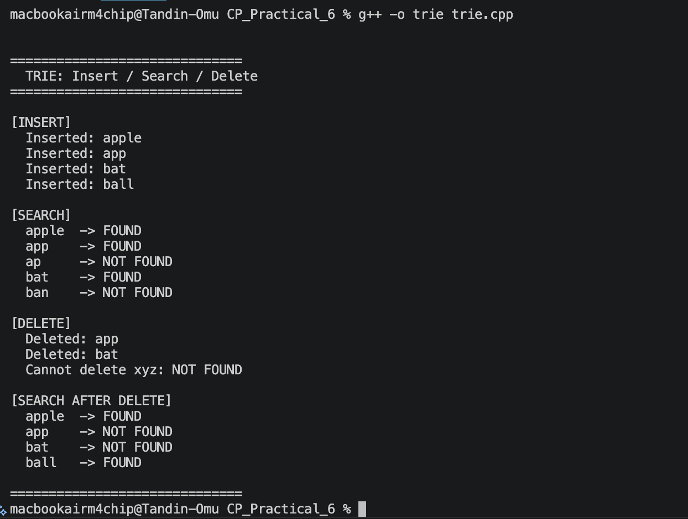
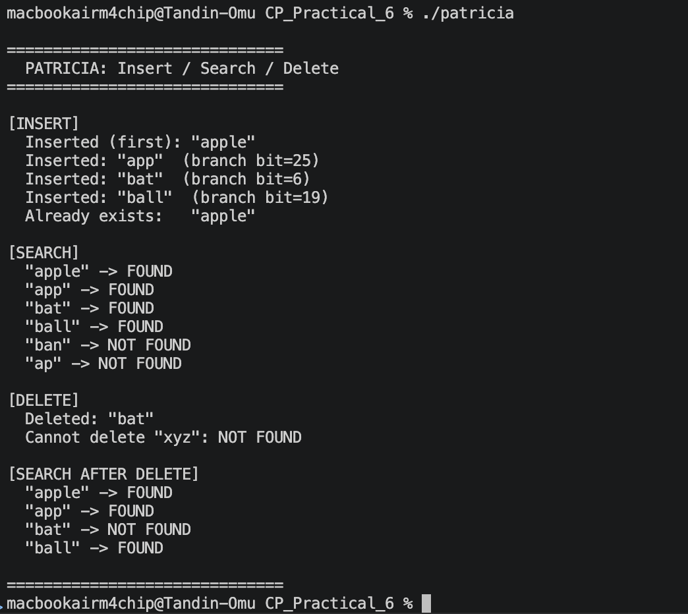
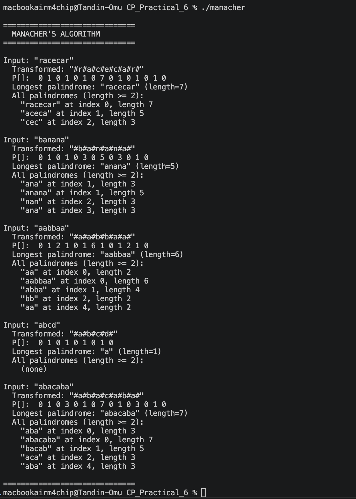

# Practical Report - String Data Structures & Algorithms
## Data Structures and Algorithms

## 1. Basic Trie

Stores strings letter by letter in a tree. Each node has 26 child slots and a flag marking end of word.

**Operations:** Insert, Search, Delete

## 2. PATRICIA Trie

Compressed trie that stores bit positions instead of characters. Removes single-child chains to save space. Uses back-links to signal end of search.

**Operations:** Insert, Search, Delete (lazy — key is blanked)

## 3. Manacher's Algorithm

Finds the longest palindromic substring in O(n) time. Inserts `#` between characters so odd and even length palindromes are handled the same way. Fills a P[] array where P[i] is the palindrome radius at position i.

## 4. Reflection

### What Was Learned

Trie was straightforward, breaking words into characters and placing them node by node makes prefix search fast. Deletion needed care to avoid removing nodes shared by other words.

PATRICIA was harder. Storing bit positions instead of characters was unfamiliar, and the back-link concept, looping back up the tree instead of using null, took time to understand.

Manacher's was the most interesting. The `#` separator trick unifies odd and even palindromes into one case. The O(n) efficiency comes from reusing already-computed P[] mirror values instead of re-checking characters.

### What Was Missed

### What Was Missed

- PATRICIA checks bits instead of characters, which was not intuitive at first
- Back-links in PATRICIA were confusing, unclear why the search loops back instead of stopping
- Manacher's reuse of mirror values was not immediately obvious

### Time Complexity

| Algorithm | Insert | Search | Delete |
|-----------|--------|--------|--------|
| Trie | O(m) | O(m) | O(m) |
| PATRICIA | O(m) | O(m) | O(m) |
| Manacher's | — | O(n) | — |

*m = length of the word, n = length of the input string*
